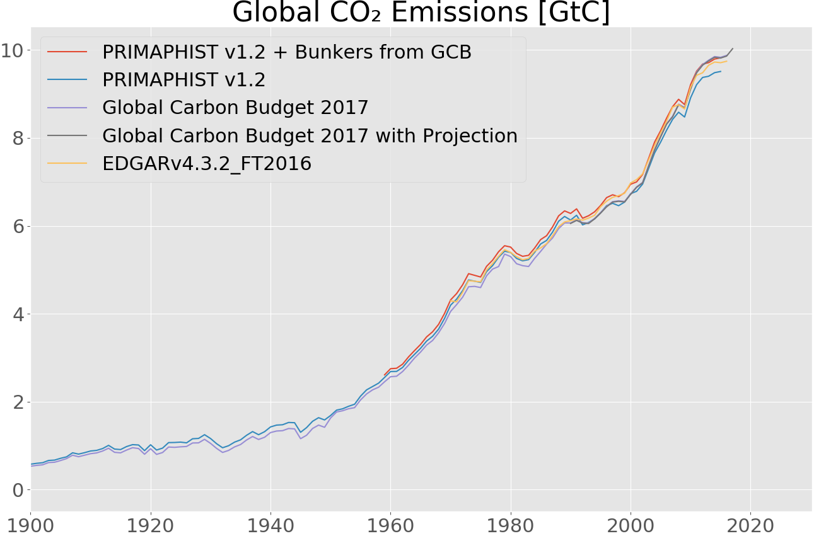

## Inputs

### CO₂

#### Fossil Fuel Industrial

The main contributor to global emissions are fossil fuel and industrial emissions which are available from multiple sources.
They are usually based on energy statistics and cement production data.
The longest time series from 1750 to 2017 (as a projection for the last year) is available in the Global Carbon Budget 2017 [@doi:10.5194/essd-10-405-2018], mainly based on data from CDIAC [@doi:10.3334/CDIAC/00001_V2017] and data submitted to the UNFCCC.
PRIMAP-hist [@doi:10.5194/essd-8-571-2016] in its version 1.2 [@doi:10.5880/PIK.2018.003] has data from 1850 to 2015 and is based on the same and other sources as the Global Carbon Budget, but does not include bunker emissions (international aviation and shipping).
The EDGAR v4.3.2_FT2016 dataset [@doi:10.5194/essd-2017-79] (in review) covers the years 1970 to 2016.

Figure @fig:global-co2 shows the sources together from 1990.

](images/global-co2.png){#fig:global-co2}

#### Land-Use

### Methane (CH₄)

### N₂O

### SOx

### CO

### NMVOC

### NOx

### BC

### OC

### NH₃

### Halocarbons

- CF4
- C2F6
- C6F14
- HFC23
- HFC32
- HFC43-10
- HFC125
- HFC134a
- HFC143a
- HFC227ea
- HFC245fa
- SF6
